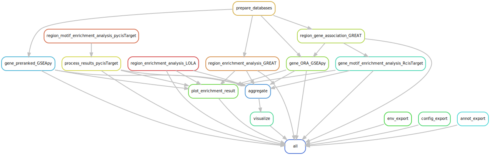

[](https://github.com/epigen/MrBiomics/)
[](https://zenodo.org/badge/latestdoi/377527671)
[]() 
[]()
[](https://github.com/epigen/enrichment_analysis/blob/master/LICENSE)

[](https://snakemake.readthedocs.io/en/stable/)

# Genomic Region & Gene Set Enrichment Analysis & Visualization Workflow for Human and Mouse Genomes.

A [Snakemake 8](https://snakemake.readthedocs.io/en/stable/) workflow for enrichment analysis and visualization of **human (hg19 or hg38) or mouse (mm9 or mm10)** based genomic region sets and (ranked) gene sets. Together with the respective background region/gene sets, the enrichment within the configured databases is determined using LOLA, GREAT, GSEApy (over-representation analysis (ORA) & preranked GSEA), pycisTarget, RcisTarget and results saved as CSV files. Additionally, the most significant results are plotted for each region/gene set, database queried, and analysis performed. Finally, the results within the same "group" (e.g.,  stemming from the same analysis) are aggregated per database and analysis in summary CSV files and visualized using hierarchically clustered heatmaps and bubble plots. For collaboration, communication and documentation of results, methods and workflow information a detailed self-contained HTML report can be generated.

> [!NOTE]  
> This workflow adheres to the module specifications of [MrBiomics](https://github.com/epigen/MrBiomics), an effort to augment research by modularizing (biomedical) data science. For more details, instructions, and modules check out the project's repository.
>
> ⭐️ **Star and share modules you find valuable** 📤 - help others discover them, and guide our focus for future work!

> [!IMPORTANT]  
> **If you use this workflow in a publication, please don't forget to give credit to the authors by citing it using this DOI [10.5281/zenodo.7810621](https://doi.org/10.5281/zenodo.7810621).**



# 🖋️ Authors
- [Stephan Reichl](https://github.com/sreichl)
- [Daria Romanovskaia](https://github.com/dariarom94)
- [Rob ter Horst](https://github.com/rubbert)
- [Christoph Bock](https://github.com/chrbock)

# 💿 Software
This project wouldn't be possible without the following software and their dependencies:

| Software       | Reference (DOI)                                   |
| :------------: | :-----------------------------------------------: |
| Enrichr        | https://doi.org/10.1002/cpz1.90                   |
| ggplot2        | https://ggplot2.tidyverse.org/                    |
| GREAT          | https://doi.org/10.1371/journal.pcbi.1010378      |
| GSEA           | https://doi.org/10.1073/pnas.0506580102           |
| GSEApy         | https://doi.org/10.1093/bioinformatics/btac757    |
| LOLA           | https://doi.org/10.1093/bioinformatics/btv612     |
| pandas         | https://doi.org/10.5281/zenodo.3509134            |
| pheatmap       | https://cran.r-project.org/package=pheatmap       |
| pycisTarget    | https://doi.org/10.1038/s41592-023-01938-4        |
| RcisTarget     | https://doi.org/10.1038/nmeth.4463                |
| rGREAT         | https://doi.org/10.1093/bioinformatics/btac745    |
| Snakemake      | https://doi.org/10.12688/f1000research.29032.2    |

# 🔬 Methods
This is a template for the Methods section of a scientific publication and is intended to serve as a starting point. Only retain paragraphs relevant to your analysis. References [ref] to the respective publications are curated in the software table above. Versions (ver) have to be read out from the respective conda environment specifications (`workflow/envs/*.yaml file`) or post-execution in the result directory (`enrichment_analysis/envs/*.yaml`). Parameters that have to be adapted depending on the data or workflow configurations are denoted in squared brackets e.g., [X].

The outlined analyses were performed using the programming languages R (ver) [ref] and Python (ver) [ref] unless stated otherwise. All approaches statistically correct their results using expressed/accessible background genomic region/gene sets from the respective analyses that yielded the query region/gene sets.

**Genomic region set enrichment analyses**

**LOLA.** Genomic region set enrichment analysis was performed using LOLA (ver) [ref], which uses Fisher’s exact test. The following databases were queried [lola_databases].

**GREAT.** Genomic region set enrichment analysis was performed using GREAT [ref] implemented with rGREAT (ver) [ref]. The following databases were queried [local_databases].

**pycisTarget.** Genomic region set TFBS (Transcription Factor Binding Site) motif enrichment analysis was performed using pycisTarget (ver) [ref]. The following databases were queried [pycisTarget_databases].

Furthermore, genomic regions (query- and background-sets) were mapped to genes using GREAT (without background) and then analyzed as gene sets as described below for a complementary and extended perspective.

**Gene set enrichment analyses (GSEA)**

**Over-representation analysis (ORA).** Gene set ORA was performed using Enrichr [ref], which uses Fisher’s exact test (i.e., hypergeometric test), implemented with GSEApy's (ver) [ref] function _enrich_. The following databases were queried [local_databases].

**Preranked GSEA.** Preranked GSEA was performed using GSEA [ref], implemented with GSEApy's (ver) [ref] function _prerank_. The following databases were queried [local_databases].

**RcisTarget.** Gene set TFBS (Transcription Factor Binding Site) motif enrichment analysis was performed using RcisTarget (ver) [ref]. The following databases were queried [RcisTarget_databases].

**Aggregation**
The results of all queries belonging to the same analysis [group] were aggregated by method and database. Additionally, we filtered the results by retaining only the union of terms that were statistically significant (i.e. [adj_pvalue]<=[adjp_th]) in at least one query.

**Visualization**
All analysis results were visualized in the same way.

For each query, method and database combination an enrichment dot plot was used to visualize the most important results.  The top [top_n] terms were ranked (along the y-axis) by the mean rank of statistical significance ([p_value]), effect-size ([effect_size]), and overlap ([overlap]) with the goal to make the results more balanced and interpretable. The significance (adjusted p-value) is denoted by the dot color, effect-size by the x-axis position, and overlap by the dot size.

The aggregated results per analysis [group], method and database combination were visualized using hierarchically clustered heatmaps and bubble plots. The union of the top [top_terms_n] most significant terms per query were determined and their effect-size and significance were visualized as hierarchically clustered heatmaps, and statistical significance ([adj_pvalue] < [adjp_th]) was denoted by \*. Furthermore, a hierarchically clustered bubble plot encoding both effect-size (color) and statistical significance (size) is provided, with statistical significance denoted by \*. All summary visualizations’ values were capped by [adjp_cap]/[or_cap]/[nes_cap] to avoid shifts in the coloring scheme caused by outliers.

**The analysis and visualizations described here were performed using a publicly available Snakemake (ver) [ref] workflow [[10.5281/zenodo.7810621](https://doi.org/10.5281/zenodo.7810621)].**


# 🚀 Features
The five tools LOLA, GREAT, pycisTarget, RcisTarget and GSEApy (over-representation analysis (ORA) & preranked GSEA) are used for various enrichment analyses. Databases to be queried can be configured (see `./config/config.yaml`). All approaches statistically correct their results using the provided background region/gene sets.
- enrichment analysis methods
    - **region set** (`\*.bed`)
        - [LOLA](http://bioconductor.org/packages/release/bioc/html/LOLA.html): Genomic Locus Overlap Enrichment Analysis is run locally using configured databases (`lola_databases`) taken from [LOLA Region Databases](https://databio.org/regiondb) or custom created using these [instructions](https://databio.org/regiondb#:~:text=Build%20your%20own%20custom%20database)
        - [GREAT](https://doi.org/10.1371/journal.pcbi.1010378) using [rGREAT](http://bioconductor.org/packages/release/bioc/html/rGREAT.html): Genomic Regions Enrichment of Annotations Tool runs locally using configured databases (`local_databases`), additional resources are downloaded automatically during the analysis.
        - [pycisTarget](https://pycistarget.readthedocs.io/en/latest/): Motif enrichment analysis in region sets to identify high confidence transcription factor (TF) cistromes is run locally using configured databases (`pycistarget_parameters:databases`) from the [cisTarget resources](https://resources.aertslab.org/cistarget/).
    - **gene set** (`\*.txt`) over-representation analysis (ORA_GSEApy)
        - [GSEApy](https://gseapy.readthedocs.io/en/latest/) enrich() function performs Fisher’s exact test (i.e., hypergeoemtric test) and is run locally using configured databases (`local_databases`).
        - [RcisTarget](https://www.bioconductor.org/packages/release/bioc/html/RcisTarget.html): Motif enrichment analysis in gene sets to identify high confidence transcription factor (TF) cistromes is run locally using configured databases (`Rcistarget_parameters:databases`) from the [cisTarget resources](https://resources.aertslab.org/cistarget/).
    - **region-based gene set** (`\*.bed`) over-representation analysis (ORA_GSEApy) & TFBS motif enrichment analysis (RcisTarget)
        - region-gene associations for each query and background region set are obtained using (r)GREAT, without accounting for background for improved performance and more genes. Correction for background is anyway included in the gene-based analyses downstream.
        - they are used for a complementary ORA using GSEApy and TFBS motif enrichment analysis using RcisTarget.
        - thereby an additional enrichment perspective for region sets can be gained through association to genes by querying the same and/or more databases, that are not supported/provided by region-based tools.
    - **preranked gene set** (`\*.csv`) enrichment analysis (preranked_GSEApy)
        - [GSEApy](https://gseapy.readthedocs.io/en/latest/) prerank() function performs [preranked GSEA](https://doi.org/10.1073/pnas.0506580102) and is run locally using configured databases (`local_databases`).
        - Note: only entries with the largest absolute score are kept and +/- infinity values are set to max/min, respectively.
- **databases** have to be provided by the user
    - databases (`local_databases`) for [rGREAT](http://bioconductor.org/packages/release/bioc/html/rGREAT.html) and [GSEApy](https://gseapy.readthedocs.io/en/latest/)
      - local GMT (`\*.gmt`) files e.g., from [MSigDB](http://www.gsea-msigdb.org/gsea/msigdb) or [Enrichr](https://maayanlab.cloud/Enrichr/#libraries)
      - local (custom) JSON (`\*.json`) files e.g., `{ "MyDB_Term1": ["geneA","geneB","geneC"],"MyDB_Term2": ["geneX","geneY","geneZ"]}`
      - always use gene symbols e.g., STAT1
      - the local databases are (converted,) copied and saved as GMT files in /resources.
    - LOLA databases for [LOLA](http://bioconductor.org/packages/release/bioc/html/LOLA.html)
      - downloaded from [LOLA Region Databases](https://databio.org/regiondb)
      - custom databases created using these [instructions]
      - pre-cached databases as .RData files are supported by simpleCache
    - cisTarget databases for [pycisTarget](https://pycistarget.readthedocs.io/en/latest/) and [RcisTarget](https://www.bioconductor.org/packages/release/bioc/html/RcisTarget.html)
      - downloaded from the [cisTarget resources](https://resources.aertslab.org/cistarget/)
      - custom databases using these [instructions](https://github.com/aertslab/create_cisTarget_databases)
- **group aggregation** of results per method and database
    - results of all queries belonging to the same group are aggregated per method (e.g., ORA_GSEApy) and database (e.g., GO_Biological_Process_2021) by concatenation and saved as a long-format table (CSV).
    - a filtered version taking the union of all statistically significant (i.e., adjusted p-value <`{adjp_th}`) terms per query is also saved as a long-format table (CSV).
- **visualization**
    - region/gene set specific enrichment dot plots are generated for each query, method and database combination
        - the top `{top_n}` terms are ranked (along the y-axis) by the mean rank of statistical significance (`{p_value}`), effect-size (`{efect_size}` e.g., log2(odds ratio) or normalized enrichemnt scores), and overlap (`{overlap}` e.g., coverage or support) with the goal to make the ranking more balanced and interpretable
        - significance (adjusted p-value) is presented by the dot color
        - effect-size is presented by the x-axis position
        - overlap is presented by the dot size
    - group summary/overview
        - the union of the top `{top_terms_n}` most significant terms per query, method, and database within a group is determined. 
        - their effect-size (effect) and statistical significance (adjp) are visualized as hierarchically clustered heatmaps, with statistical significance denoted by `\*` (PDF).
        - a hierarchically clustered bubble plot encoding both effect-size (color) and significance (size) is provided, with statistical significance denoted by `\*` (PNG).
        - all summary visualizations are configured to cap the values (`{adjp_cap}`/`{or_cap}`/`{nes_cap}`) to avoid shifts in the coloring scheme caused by outliers.
- **results** (`{result_path}/enrichment_analysis`)
    - the result directory contains a folder for each region/gene set `{query}` and `{group}`
    - `{query}/{method}/{database}/` containing:
        - result table (CSV): `{query}\_{database}.csv`
        - enrichment dot plot (PNG): `{query}\_{database}.{png}`
    - `{group}/{method}/{database}/` containing
        - aggregated result table (CSV): `{group}\_{database}\_all.csv`
        - filtered aggregated result table (CSV): `{group}\_{database}\_sig.csv`
        - hierarchically clustered heatmaps visualizing statistical significance and effect-sizes of the top `{top_terms_n}` terms (PDF): `{group}\_{database}\_{adjp|effect}\_heatmap.pdf`
        - hierarchically clustered bubble plot visualizing statistical significance and effect-sizes simultaneously (PNG):  `{group}\_{database}\_summary.{png}`

Note:
- Despite usage of the correct parameter, **rGREAT** was not using the provided cores during testing. Nevertheless, it is still provided as parameter.
- **(r)GREAT** performs [two statistical test](https://great-help.atlassian.net/wiki/spaces/GREAT/pages/655456/Statistics) (binomial and hypergeometric), results of both are reported and should be considered. Which results are used for the visualization can be configured in `column_names:GREAT`.
- **pycisTarget** for region set enrichment does not use the provided background regions. In case this is desired (e.g., conensus regions or TF ChIP-seq data) follow the [instructions for custom cisTarget databases](https://github.com/aertslab/create_cisTarget_databases) using your own regions and use them as database.

# 🛠️ Usage
Here are some tips for the usage of this workflow:
1. Download all relevant databases (see [Resources](#resources)).
2. Configure the analysis using the configuration YAML and an annotation file (see [Configuration](#configuration))
3. Run the analysis on every query gene/region set of interest (e.g., results of differential analyses) with the respective background genes/regions (e.g., all expressed genes or consensus regions).
4. generate the [Snakemake Report](https://snakemake.readthedocs.io/en/stable/snakefiles/reporting.html)
5. look through the overview plots of your dedicated groups and queried databases in the report
6. dig deeper by looking at the 
    - aggregated result table underlying the summary/overview plot
    - enrichment plots for the individual query sets
7. investigate interesting hits further by looking into the individual query result tables.

# ⚙️ Configuration
Detailed specifications can be found here [./config/README.md](./config/README.md)

# 📖 Examples
We provide four example queries across all tools with four different databases:
- three are region sets from a [LOLA Vignette](http://code.databio.org/LOLA/articles/usingLOLACore.html). Download the example data by following the instructions below.
- one is a preranked gene-score set derived from the GDS289 [fgsea R package example data](https://github.com/ctlab/fgsea/blob/master/inst/extdata/GDS289.tsv) (`score=-log10(p-value) * sign(LFC)`).
- the total runtime was ~23 minutes on an HPC with 1 core and 32GB RAM per job.
- note: we are using a hg38 database for pycistarget, because the respective hg19 database is not compatible with the current pycisTarget version (https://github.com/aertslab/pycistarget/issues/37).

Follow these steps to run the complete analysis:
1. Download all necessary data (query and resources)
    ```sh
    # change working directory to the cloned worklfow/module enrichment_analysis
    cd enrichment_analysis

    # download and extract the region set test data
    wget -c http://cloud.databio.org.s3.amazonaws.com/vignettes/lola_vignette_data_150505.tgz -O - | tar -xz -C test/data/

    # create and enter resources folder
    mkdir resources
    cd resources

    # download LOLACore databases and move to the correct location
    wget http://big.databio.org/regiondb/LOLACoreCaches_180412.tgz
    tar -xzvf LOLACoreCaches_180412.tgz
    mv nm/t1/resources/regions/LOLACore/ .
    rm -rf nm

    # download a local database
    wget https://data.broadinstitute.org/gsea-msigdb/msigdb/release/2023.2.Hs/c2.cgp.v2023.2.Hs.symbols.gmt

    # download cisTarget resources
    mkdir cistarget
    cd cistarget
    wget https://resources.aertslab.org/cistarget/databases/homo_sapiens/hg38/refseq_r80/mc_v10_clust/gene_based/hg38_500bp_up_100bp_down_full_tx_v10_clust.genes_vs_motifs.rankings.feather
    wget https://resources.aertslab.org/cistarget/databases/homo_sapiens/hg38/screen/mc_v10_clust/region_based/hg38_screen_v10_clust.regions_vs_motifs.rankings.feather
    wget https://resources.aertslab.org/cistarget/motif2tf/motifs-v10nr_clust-nr.hgnc-m0.001-o0.0.tbl

    # change your working directory back to the root of the module
    cd ../../
    ```
2. activate your conda Snakemake environment, run a dry-run (-n flag), run the workflow and generate the report using the provided configuration
    ```sh
    conda activate snakemake
    # dry-run
    snakemake -p --use-conda --configfile test/config/example_enrichment_analysis_config.yaml -n
    # real run
    snakemake -p --use-conda --configfile test/config/example_enrichment_analysis_config.yaml
    # report
    snakemake --report test/report.html --configfile test/config/example_enrichment_analysis_config.yaml
    ```

# 🔗 Links
- [GitHub Repository](https://github.com/epigen/enrichment_analysis/)
- [GitHub Page](https://epigen.github.io/enrichment_analysis/)
- [Zenodo Repository](https://doi.org/10.5281/zenodo.7810621)
- [Snakemake Workflow Catalog Entry](https://snakemake.github.io/snakemake-workflow-catalog?usage=epigen/enrichment_analysis)

# 📚 Resources
- Helper scripts
  - [Combine all text files within a specified folder into one JSON to be used as database.](./helpers/txts_to_json_database.py)
  - [Generate a file listing CSV of the current folder as basis for the annotation file.](./helpers/feature_list_to_csv.sh)
- Recommended compatible [MrBiomics](https://github.com/epigen/MrBiomics) modules for upstream processing and analyses:
    - [ATAC-seq Processing](https://github.com/epigen/atacseq_pipeline) to quantify chromatin accessibility.
    - [scRNA-seq Data Processing & Visualization](https://github.com/epigen/scrnaseq_processing_seurat) for processing (multimodal) single-cell transcriptome data.
    - [<ins>Sp</ins>lit, F<ins>ilter</ins>, Norma<ins>lize</ins> and <ins>Integrate</ins> Sequencing Data](https://github.com/epigen/spilterlize_integrate/) after count quantification.
    - [Differential Analysis with limma](https://github.com/epigen/dea_limma) to identify and visualize statistically significantly different features (e.g., genes or genomic regions) between sample groups.
    - [Differential Analysis using Seurat](https://github.com/epigen/dea_seurat) to identify and visualize statistically significantly different features (e.g., genes or proteins) between groups.
- Package for [simplifying enrichment](http://www.bioconductor.org/packages/release/bioc/html/simplifyEnrichment.html) results using the [ComplexHeatmap](https://bioconductor.org/packages/release/bioc/html/ComplexHeatmap.html) package.
- Web versions of some of the used tools
    - [LOLA](http://lolaweb.databio.org/)
    - [GREAT](http://great.stanford.edu/public/html/index.php)
    - [Enrichr](https://maayanlab.cloud/Enrichr/)
- Databases & resources for region/gene sets
    - [LOLA region databases](https://databio.org/regiondb)
      - [custom LOLA database instructions](https://databio.org/regiondb#:~:text=Build%20your%20own%20custom%20database)
    - [cisTarget resources](https://resources.aertslab.org/cistarget/)
      - [custom cistarget database instructions](https://github.com/aertslab/create_cisTarget_databases)
    - [Enrichr gene set databases](https://maayanlab.cloud/Enrichr/#libraries)
    - [The Molecular Signatures Database (MSigDB)](https://www.gsea-msigdb.org/gsea/msigdb/)

# 📑 Publications
The following publications successfully used this module for their analyses.
- [FirstAuthors et al. (202X) Journal Name - Paper Title.](https://doi.org/10.XXX/XXXX)
- ...

# ⭐ Star History

[](https://star-history.com/#epigen/enrichment_analysis&Date)
